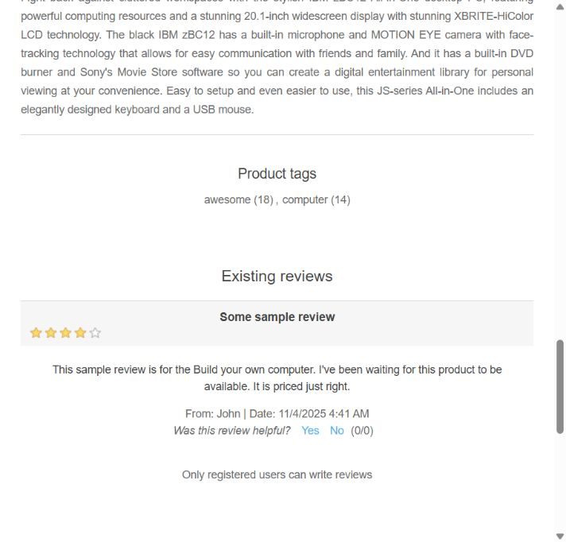

# BUG-001: Описание товара не соответствует названию

**Ссылка:** https://demo.nopcommerce.com/build-your-own-computer  
**Дата обнаружения:** 2026-09-04  
**Окружение:** Yandex Browser 26.8.0.1788 (64-bit) / desktop  
**Тип:** Content / Functional

## Предусловия

Открыт сайт nopCommerce Demo Store.

## Шаги воспроизведения

1. Открыть категорию **Computers → Desktops**.
2. Открыть товар **Build your own computer**.
3. Прокрутить страницу до блока с описанием товара.

## Фактический результат

В описании товара **Build your own computer** отображается текст про **IBM zBC12 All-in-One**:

> Fight back against cluttered workspaces with the stylish IBM zBC12 All-in-One desktop PC...

Описание не соответствует названию товара и его конфигурациям.

## Ожидаемый результат

В карточке отображается описание, соответствующее товару **Build your own computer**, его характеристикам и назначению.

## Влияние

Пользователь может получить неверную информацию о товаре и принять решение на основе несоответствующего описания.

## Severity

**Medium** — ошибка не блокирует покупку, но снижает достоверность информации о товаре.

## Priority

**Medium** — рекомендуется исправить до публикации обновления каталога.

## Статус

**Open**
## Evidence

[Открыть изображение отдельно](../evidence/BUG-001-description-evidence.png)
